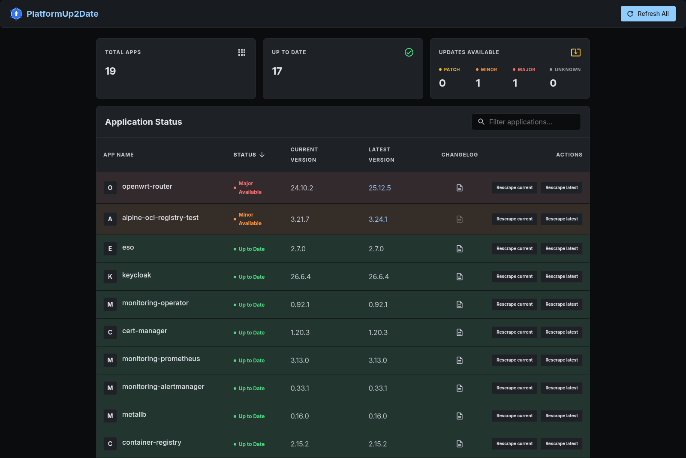

#  PlatformUp2Date

You run a platform, a home cluster, or just a pile of applications that keep
your work, leisure, or archiving going smooth. Only issue: *every* single *app*
is waaay *out of date*. Let's change that!

PlatformUp2Date monitors deployed applications against their latest upstream
releases and shows, per app, whether it's up-to-date or behind — regardless
of how or where that app is deployed. "Current" always means the app's
actually-observed running state, never a declared value like a GitOps repo
pin (see [`ARCHITECTURE.md`](ARCHITECTURE.md)); "latest" comes from an
independent upstream source such as GitHub Releases or a container
registry's tag list.

It integrates with Prometheus/Grafana and ships its own frontend — deploy it
or don't :) It also serves an [MCP endpoint](#mcp-endpoint), so an AI agent
can ask what's outdated and read the changelogs while helping you upgrade.

[](https://github.com/sreyardship/PlatformUp2Date/actions/workflows/edge.yml)
[](https://github.com/sreyardship/PlatformUp2Date/releases/latest)
[](LICENSE)



## Quick taste (no toolchain required)

All you need is Docker. This pulls the published images from GHCR instead of
building anything locally:

```bash
git clone https://github.com/sreyardship/PlatformUp2Date.git
cd PlatformUp2Date
docker compose -f compose.quickstart.yml up
```

Then open [localhost:3000](http://localhost:3000). Within a few seconds you
should see two cards:

- **mastodon** — `current` is read from the public
  [chaos.social](https://chaos.social) instance's API (a genuinely observed
  running version, not a repo pin); `latest` comes from GitHub Releases.
  chaos.social upgrades conservatively, so this card is usually *behind* —
  showing what drift detection looks like: a red/orange card with the
  current and latest versions side by side, and a changelog link to the
  release it's missing.
- **gitea** — `current` is read from the public
  [gitea.com](https://gitea.com) SaaS instance's version API; `latest` comes
  from Gitea's official image tags on Docker Hub. gitea.com tracks upstream
  closely, so this card is usually *green* (up to date).

Both instances are live third-party services, so the exact colors on any
given day depend on what they happen to be running. Both apps resolve
without any credentials — see
[`docs/samples/platform-config.yaml`](docs/samples/platform-config.yaml) for
the exact config, and [`docs/configuration.md`](docs/configuration.md) for
every source type and config key available for your own apps.

## Build from source

For contributing, or if you'd rather build the images yourself,
`compose.yml` builds both from source instead of pulling from GHCR (the
backend must be built with Gradle first):

```bash
cd backend && gradle build && cd ..
docker compose up -d
```

Then go to [localhost:3000](http://localhost:3000).

## Documentation

- [`docs/configuration.md`](docs/configuration.md) — every version-source
  type, every config key, version schemes, changelog-link templates.
- [`docs/deployment.md`](docs/deployment.md) — running this for real:
  Kubernetes (the primary target, though any OCI runtime works), HA and
  replicas, Valkey, RBAC for the `k8s-image` source, Prometheus scraping,
  alert rules, the Grafana dashboard.
- [`ARCHITECTURE.md`](ARCHITECTURE.md) — the design principles behind the
  substrate-agnostic version-source model.
- [`CONTEXT.md`](CONTEXT.md) — glossary of project-specific terms.
- [`docs/adr/`](docs/adr/) — architecture decision records for individual
  design choices.

## Metrics & Alerting

The backend exposes a Prometheus scrape endpoint at `/metrics`, hand-rendered in the
Prometheus text exposition format (no Micrometer). Four metric families are exported:
`pu2d_version_drift_level`, `pu2d_application_info`, `pu2d_scrape_last_success_timestamp_seconds`,
and `pu2d_scrape_last_failure_timestamp_seconds` — see [`docs/deployment.md`](docs/deployment.md#metrics)
for the full list. The core one for version monitoring is a gauge:

```
# HELP pu2d_version_drift_level How far the deployed version is behind latest (0=current, 1=patch, 2=minor, 3=major)
# TYPE pu2d_version_drift_level gauge
pu2d_version_drift_level{app="argo-cd"} 3
pu2d_version_drift_level{app="git-tea"} 0
```

One gauge answers both questions: whether an app is outdated, and how far behind it
is — the value is the highest-significance semver difference between the deployed and
latest version. Two caveats: pre-release differences report as `1`, and a difference
in build metadata only is ignored and reports as `0`. `pu2d_application_info` carries
the actual current/latest version strings and covers every configured app, including
ones that haven't resolved yet.

For more detail than the gauges carry, use the frontend or the
`GET /api/v1/version` endpoint. For scraping setup, alert rules, and the bundled
Grafana dashboard on a real cluster, see [`docs/deployment.md`](docs/deployment.md).


## MCP endpoint

The backend exposes a [Model Context Protocol](https://modelcontextprotocol.io/) server
so an AI agent can ask "which monitored applications are out of date, and how far behind?"
without any custom integration. It is a third read surface over the same data as `/metrics`
and `GET /api/v1/version` — any MCP-capable host can connect and discover the tools at
runtime.

Transport is **Streamable HTTP**, served at `/api/mcp` on the backend's HTTP port. It runs
stateless (each request auto-initialises its own throwaway session), so the endpoint works
behind multiple replicas with no session affinity.

### Tools

- **`list_outdated_applications(minSeverity?)`** — returns the applications running behind
  their latest upstream release, each as `{ name, current, latest, outdated, drift }` where
  `drift` is `PATCH` / `MINOR` / `MAJOR`. The optional `minSeverity` argument
  (`PATCH` | `MINOR` | `MAJOR`) filters by how far behind an app is; omit it to get every
  app with any drift.
- **`get_application(name)`** — returns the status of a single application by exact name,
  or nothing if it isn't monitored.

The drift verdict is computed server-side by the same tested semver logic that backs the
metrics gauge, so the caller never has to compare versions itself.

### Connecting a client

Point any MCP client that supports remote Streamable HTTP servers at:

```
https://platformup2date.example.com/api/mcp
```

Most MCP-capable CLIs have a built-in subcommand for registering a remote HTTP
server (consult your client's docs); the shape is generally
`<your-mcp-client> mcp add --transport http platformup2date <url>`.

### Security

The endpoint ships **unauthenticated** — it is meant to sit behind a reverse proxy that
enforces access, exactly like the `/metrics` endpoint. Do not expose it directly on an
untrusted network: it enumerates your infrastructure's version drift, which is useful recon
for an attacker.

A common setup is [`oauth2-proxy`](https://oauth2-proxy.github.io/oauth2-proxy/) in front of
`/api/mcp`, configured to accept bearer JWTs from your OIDC issuer:

```
--skip-jwt-bearer-tokens=true
--oidc-issuer-url=https://auth.example.com/realms/yourrealm
```

Most MCP clients can't perform an interactive OIDC login on their own, so a small wrapper
fetches a token with [`oauth2c`](https://github.com/cloudentity/oauth2c) and bridges the
client's stdio to the protected Streamable HTTP endpoint via
[`mcp-remote`](https://www.npmjs.com/package/mcp-remote).

**1. Token helper — `oidc-token.sh`** (PKCE public-client flow, cached until the JWT expires):

```bash
#!/usr/bin/env bash
set -euo pipefail

OIDC_ISSUER="${OIDC_ISSUER:-https://auth.example.com/realms/yourrealm}"
OIDC_CLIENT_ID="${OIDC_CLIENT_ID:-platformup2date-mcp}"
CACHE="${XDG_RUNTIME_DIR:-/tmp}/platformup2date-mcp-token"

token_expired() {
  local t="${1:-}"; [ -z "$t" ] && return 0
  local exp
  exp=$(echo "$t" | cut -d. -f2 | tr '_-' '/+' | base64 -d 2>/dev/null | jq -r '.exp // 0')
  [ "$(date +%s)" -ge "$exp" ]
}

token=$(cat "$CACHE" 2>/dev/null || true)
if token_expired "$token"; then
  token=$(oauth2c "$OIDC_ISSUER" \
    --client-id "$OIDC_CLIENT_ID" \
    --response-types code --grant-type authorization_code \
    --auth-method none --pkce --scopes openid --silent \
    | jq -r '.access_token // empty')
  [ -n "$token" ] || { echo "failed to obtain OIDC token" >&2; exit 1; }
  umask 177; printf '%s' "$token" > "$CACHE"
fi
printf '%s' "$token"
```

**2. MCP wrapper — `platformup2date-mcp.sh`** (bridges the client to the protected MCP URL):

```bash
#!/usr/bin/env bash
set -euo pipefail

TOKEN=$("$(dirname "$0")/oidc-token.sh")
MCP_URL="${PLATFORMUP2DATE_MCP_URL:-https://platformup2date.example.com/api/mcp}"

exec npx -y mcp-remote "$MCP_URL" --header "Authorization: Bearer ${TOKEN}"
```

**3. Register the wrapper with your client** using its own "add a local MCP server
command" mechanism, pointing it at `/path/to/platformup2date-mcp.sh`.

The wrapper runs per session: it reuses the cached token, transparently re-runs the
`oauth2c` login once the JWT expires, and oauth2-proxy validates the bearer token before
the request reaches the backend. The application itself stays auth-agnostic.

> If your client supports remote Streamable HTTP servers with custom headers directly, you can skip
> `mcp-remote` and pass `Authorization: Bearer $(./oidc-token.sh)` as a header — but a
> wrapper keeps the token fresh across expiries without editing client config.

## Contributing

Build from source (above), make your change, and open a pull request. Every
PR runs a fast JVM test job and a full GraalVM native build with native
integration tests — both are required to merge, so native-only regressions
never slip through.
