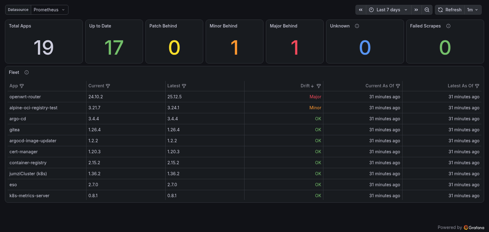

# Deploying to Kubernetes

The README's quick start (`compose.quickstart.yml`) is for trying the tool out
locally. This page is for running it for real, on your own cluster.

Kubernetes is the primary deployment target (it's where the tool is developed
and run) but nothing requires it: both images are plain OCI images that run on
any OCI-compatible runtime (Docker, Podman, containerd), as the compose
quickstart shows. The one Kubernetes-only piece is the `k8s-image` current
source, which reads workloads from the Kubernetes API and auto-configures
in-cluster.

The backend is designed to run highly available. All scrape state lives in
Valkey and every surface (REST, frontend, metrics, MCP) is a stateless
projection of it, so replicas are interchangeable: run as many as you like
with no session affinity, and a scrape on any replica updates what all of
them serve (see [`docs/adr/0003`](adr/0003-scrape-state-centralised-in-valkey.md)
and [`docs/adr/0004`](adr/0004-mcp-transport-stateless-for-ha.md)).

## The shipped manifests

Deployable manifests live under [`deploy/k8s/`](../deploy/k8s/) as a kustomize
tree (kustomize-only; see
[`docs/adr/0027`](adr/0027-deploy-manifests-are-kustomize-only.md)):

```
deploy/k8s/
├── base/                  # backend (2 replicas) + frontend, namespace-agnostic
│   └── platform-config.yaml   # the canonical sample config (a ConfigMap you replace)
├── components/
│   ├── valkey/            # bundled single-replica Valkey (quickstart datastore)
│   └── rbac/              # opt-in ClusterRole for the k8s-image source
└── overlays/
    └── quickstart/        # namespace + base + valkey + a host-less Ingress
```

### Try it on a cluster

```bash
kubectl apply -k deploy/k8s/overlays/quickstart
```

This creates the `platformup2date` namespace and serves the UI through a
host-less, class-less Ingress on your cluster's default IngressClass (k3s and
minikube ship one; elsewhere patch `ingressClassName` as shown in
[`overlays/quickstart/ingress.yaml`](../deploy/k8s/overlays/quickstart/ingress.yaml)).
The routing contract is: `/api` → backend **unstripped**, everything else →
frontend; the frontend's `API_BASE_URL` stays empty so browser calls are
same-origin (no CORS).

### Run it for real: write an overlay

Reference the base as a remote base, pinned to a release tag so the image pins
inside it match:

```yaml
# kustomization.yaml
apiVersion: kustomize.config.k8s.io/v1beta1
kind: Kustomization
namespace: my-namespace

resources:
  - https://github.com/sreyardship/PlatformUp2Date//deploy/k8s/base?ref=v0.0.48
  - namespace.yaml

# Your real monitoring config, replacing the sample wholesale. The generated
# hash suffix rolls the backend automatically on every config change.
configMapGenerator:
  - name: platform-config
    behavior: replace
    files:
      - platform-config.yaml
```

Argo CD and Flux both consume this directly (it's a plain kustomization).

- **Credentials** (`GITHUB_TOKEN`, `HARBOR_USER`/`HARBOR_PASS`, …) need no
  patching at all: the backend Deployment carries an `optional: true`
  `envFrom` hook on a Secret named `platformup2date-env`. Create it and its
  keys become env vars:

  ```bash
  kubectl -n my-namespace create secret generic platformup2date-env \
    --from-literal=GITHUB_TOKEN=ghp_…
  ```

  File-shaped secrets (the `ssh-os-release` private key, custom CAs) stay
  volume mounts — add the Secret volume and `volumeMounts` patch in your
  overlay (see [`configuration.md`](configuration.md#type-ssh-os-release-current--tier-b-requires-ssh-access)
  for the paths the config expects).
- **Ingress**: the base ships none (the quickstart's Ingress lives in the
  overlay). Add your own Ingress/HTTPRoute honouring the routing contract
  above.

### Valkey: bundled or bring your own

The base deliberately bundles **no** datastore. The quickstart adds
`components/valkey`: a single replica, no persistence. That's honest for this
workload, since scrape state is rebuildable (losing the pod costs one
re-scrape; only the fleet staleness clock and manual-scrape budgets reset).

For an HA datastore, run your own Valkey/Redis (operator, managed service,
Sentinel — anything Redis-API-compatible) and point the backend at it with an
env patch; the storage adapter uses only simple single-key commands, so
standalone, Sentinel and cluster topologies all work:

```yaml
patches:
  - patch: |-
      apiVersion: apps/v1
      kind: Deployment
      metadata:
        name: platformup2date-backend
      spec:
        template:
          spec:
            containers:
              - name: backend
                env:
                  - name: QUARKUS_REDIS_HOSTS
                    value: redis://my-valkey:6379
```

For Sentinel, set `QUARKUS_REDIS_CLIENT_TYPE=sentinel`,
`QUARKUS_REDIS_HOSTS=redis://sentinel-0:26379,redis://sentinel-1:26379,…` and
`QUARKUS_REDIS_MASTER_NAME=<master>` instead. One caveat: with async
replication a failover can lose the last few writes; here that means at
worst one re-scrape, which is what the state model is built to tolerate.

While Valkey is unreachable the backend fails closed (503) and its readiness
probe (`/q/health/ready`) reports DOWN, pulling replicas out of rotation until
it returns.

### k8s-image RBAC

Only if an app in your config uses the `k8s-image` current source, add
`components/rbac` to your overlay:

```yaml
components:
  - https://github.com/sreyardship/PlatformUp2Date//deploy/k8s/components/rbac?ref=v0.0.48
```

It grants cluster-wide read-only `get` on Deployments/StatefulSets/DaemonSets
(no `list`/`watch`, no writes, no secrets) to the `platformup2date`
ServiceAccount the base always creates. **Namespace caveat**: a
ClusterRoleBinding subject names a concrete namespace and kustomize's
`namespace:` transformer does *not* rewrite it (it only rewrites subjects named
`default`). If you deploy to any namespace not literally called
`platformup2date`, patch it:

```yaml
patches:
  - patch: |-
      - op: replace
        path: /subjects/0/namespace
        value: my-namespace
    target: {kind: ClusterRoleBinding, name: platformup2date-read-workloads}
```

## What the backend needs (outside Kubernetes)

Running on plain Docker/Podman/anything-OCI instead? The base manifests wire
up two things you'll need to reproduce (the compose quickstart shows
both):

- **A reachable Valkey (or Redis-API-compatible) instance.** All scrape state
  (the observed Applications, the fleet-wide staleness clock, and the
  manual-scrape budgets) lives centrally in Valkey, not in the JVM. This makes every
  replica serve the same snapshot, but it is a hard dependency: if Valkey is
  unreachable, reads and scrape triggers fail closed (503) rather than falling
  back to a per-instance cache. Point the backend at it with
  `QUARKUS_REDIS_HOSTS=redis://<host>:6379`.
- **A mounted `platform-config` file**, supplied via
  `QUARKUS_CONFIG_LOCATIONS=/config/platform-config.yaml`. Nothing is baked
  into the image, so changing the watched apps is a config edit,
  not an image rebuild. See [`configuration.md`](configuration.md) for every
  key. The `k8s-image` current source auto-configures from the in-cluster
  ServiceAccount (Fabric8) and needs the RBAC component above; it has no
  out-of-cluster story. `ssh-os-release` instead needs its private key and
  known-hosts/host-key mounted (see
  [`configuration.md`](configuration.md#type-ssh-os-release-current--tier-b-requires-ssh-access))
  and no Kubernetes RBAC at all.

## MCP endpoint authentication

If you turn on MCP endpoint authentication (`OIDC_ISSUER` +
`OIDC_AUDIENCE`, see [`configuration.md`](configuration.md#surface-authentication-mcp--web)),
it has two consequences for anything sitting in front of the backend:

- **The shared `HTTPRoute` needs one added rule.** [`docs/adr/0002`](adr/0002-mcp-endpoint-under-api.md)'s
  "no ingress change needed" holds only while the endpoint is unauthenticated.
  RFC 9728 protected-resource metadata is served at the host root
  (`/.well-known/oauth-protected-resource/api/mcp`), outside the `/api`
  prefix: the existing `/api` PathPrefix rule does not cover it, and the
  catch-all `/` rule would hand it to the frontend instead of the backend.
  Add a PathPrefix rule sending `/.well-known/oauth-protected-resource` to
  the backend, unstripped:

  ```yaml
  apiVersion: gateway.networking.k8s.io/v1
  kind: HTTPRoute
  metadata:
    name: platformup2date
  spec:
    rules:
      - matches:
          - path:
              type: PathPrefix
              value: /api
        backendRefs:
          - name: platformup2date-backend
            port: 8080
      - matches:
          - path:
              type: PathPrefix
              value: /.well-known/oauth-protected-resource
        backendRefs:
          - name: platformup2date-backend
            port: 8080
      - matches:
          - path:
              type: PathPrefix
              value: /
        backendRefs:
          - name: platformup2date-frontend
            port: 80
  ```

  The metadata path is not relocated under `/api`: fighting the well-known
  convention would break client-side URL derivation, so the extra rule is
  required rather than optional.

- **Any edge proxy in front of the host must get out of MCP's way.** If
  `oauth2-proxy` (or similar) still fronts the host for the web UI/REST
  interim posture below, it must bypass `/api/mcp` and
  `/.well-known/oauth-protected-resource*` (e.g. oauth2-proxy's
  `--skip-auth-route`), or it intercepts the challenge/discovery requests
  before the backend can answer them, breaking native MCP client
  authentication.

> **DCR caveat.** Native client discovery leans on your issuer supporting
> *dynamic client registration*. If it doesn't, enable DCR or pre-register
> the client IDs your MCP clients use; otherwise the flow dies mysteriously
> at registration, which is your IdP's concern, not this app's.

With MCP endpoint authentication off (`OIDC_ISSUER` unset, the default),
neither change applies and the endpoint behaves exactly as described in
[ADR 0002](adr/0002-mcp-endpoint-under-api.md).

## Web UI authentication

The web UI and REST API (`/api/v1`) authenticate against the same shared
issuer as MCP, gated by their own role var (`WEB_OIDC_ROLE`, default
`pu2d-web` — see [`configuration.md`](configuration.md#surface-authentication-mcp--web)).
Turning it on has different cluster-level consequences than MCP:

- **No ingress change is needed.** Unlike MCP's
  `/.well-known/oauth-protected-resource` HTTPRoute rule above, the SPA
  discovers the IdP directly from its own runtime config
  (`OIDC_AUTHORITY`/`OIDC_CLIENT_ID`, injected into `window._env_` the same
  way `API_BASE_URL` already is). There is no server-side protected-resource
  metadata document for the web surface, so nothing new needs routing at the
  host root. The existing `/api` PathPrefix rule (unstripped, to the backend)
  and the catch-all `/` rule (to the frontend) are unchanged.
- **Enabling web auth gates `/api/v1`, not the SPA static shell.** The
  frontend `Service`/`Deployment` still serves the page to anyone: the JS
  bundle has to load and run before it can redirect an anonymous visitor to
  the IdP. A BFF or an edge proxy in front of the host *would* hide the page
  itself; this SPA-as-OIDC-client topology structurally cannot (see
  [ADR 0028](adr/0028-web-and-mcp-surfaces-role-gated-behind-one-issuer.md)).
  If hiding the page itself matters to you, that's still an edge-proxy
  decision, not something this feature does for you.
- **`/metrics`, `/q/health`, and the OpenAPI spec (`/q/openapi`) stay open**
  regardless of web-auth state — none of them live under `/api/v1`, so
  neither surface's role gate touches them.
- **Dev-mode CORS**: the Vite dev server serves the SPA from
  `localhost:3000` while Quarkus serves the API from `localhost:8080` (a
  cross-origin request in dev only). The `%dev`-scoped CORS block in
  `application.yml` pins `origins` to that exact dev origin (never `*`) and
  allows the `authorization` header so the bearer token can be attached.
  Production is same-origin behind `/api` (no CORS needed there).
- **Any edge proxy in front of the host must still bypass MCP's paths**
  (as above) if you keep one for defense-in-depth once web auth is in-app.
  The two mechanisms are independent and can coexist, but the proxy must not
  intercept `/api/mcp` or the well-known path.

The SPA runs Authorization Code + PKCE (`oidc-client-ts` /
`react-oidc-context`), holds the access token in memory only (never
`localStorage`/`sessionStorage`), and silently renews it in the background.
A caller whose token lacks the role gets a distinct *Not authorized* screen
(a 403 from the backend, not a login failure) with a log-out action.

**IdP prerequisites.** Register the SPA as a **public client with PKCE** (no
client secret) in your IdP:

- redirect URI = the SPA's own origin, `/` (e.g.
  `https://platformup2date.example.com/`)
- a matching post-logout / end-session redirect URI: log-out is RP-initiated
  (it ends the IdP session, not just the local token)
- silent-renew (refresh) enabled/expected, so a page reload doesn't force a
  full re-login
- grant the `pu2d-web` role (or whatever `WEB_OIDC_ROLE` is set to) as a
  realm/group role to whichever users should reach the app; granting the
  role is what actually admits a caller, independent of whether they can
  authenticate against the IdP at all

If you leave `WEB_OIDC_ROLE` (or `OIDC_ISSUER` entirely) unset, protect the
web UI and REST API the same way you would have protected the whole host
before this feature existed: an edge proxy such as `oauth2-proxy` in front of
the host, or a private network.

## Metrics

The backend exposes a Prometheus scrape endpoint at `/metrics`, hand-rendered
in the Prometheus text exposition format (no Micrometer). Four metric
families are exported:

- `pu2d_application_info` — fleet membership + current/latest version strings.
- `pu2d_version_drift_level` — how far the deployed version is behind latest
  (`0`=current, `1`=patch, `2`=minor, `3`=major; a pre-release difference
  reports as `1`, while a difference in build metadata only is ignored and
  reports as `0`). Calver apps grade by the category of the changed token:
  year → `3`, month/week/day → `2`, micro/modifier → `1` (see
  [`configuration.md`](configuration.md#calver-format)).
- `pu2d_scrape_last_success_timestamp_seconds` — per-(app, side) freshness.
- `pu2d_scrape_last_failure_timestamp_seconds` — per-(app, side) failures.

```
# HELP pu2d_version_drift_level How far the deployed version is behind latest (0=current, 1=patch, 2=minor, 3=major)
# TYPE pu2d_version_drift_level gauge
pu2d_version_drift_level{app="argo-cd"} 3
pu2d_version_drift_level{app="git-tea"} 0
```

### Scraping with Prometheus Operator

Point a `ServiceMonitor` at the backend `Service`'s HTTP port:

```yaml
apiVersion: monitoring.coreos.com/v1
kind: ServiceMonitor
metadata:
  name: platformup2date
  labels:
    release: prometheus  # match your Prometheus Operator's serviceMonitorSelector
spec:
  selector:
    matchLabels:
      # These match the backend Service shipped in deploy/k8s/base — the
      # component label matters, or Prometheus also scrapes the frontend
      # Service (same name label, same `http` port name, no /metrics).
      app.kubernetes.io/name: platformup2date
      app.kubernetes.io/component: backend
  endpoints:
    - port: http
      path: /metrics
      interval: 1m
```

### Example alert rules

Two starting points: page when an app falls a major version behind, and when
scraping itself has gone quiet. With the default `scrape-interval: 1h`, a
success timestamp older than six hours means roughly six missed scrapes:

```yaml
groups:
  - name: platformup2date
    rules:
      - alert: AppMajorVersionBehind
        expr: pu2d_version_drift_level >= 3
        for: 6h
        labels:
          severity: warning
        annotations:
          summary: '{{ $labels.app }} is a major version behind its latest upstream release'

      - alert: AppScrapeStale
        expr: time() - pu2d_scrape_last_success_timestamp_seconds > 6 * 3600
        labels:
          severity: warning
        annotations:
          summary: 'No successful {{ $labels.side }} scrape for {{ $labels.app }} in over 6h'
```

Tune the thresholds to your own scrape interval and patience. For anything
fancier: I believe in you! You can figure it out, gambare!

## Grafana dashboard

A default dashboard ships in this repo at [`grafana/platform-up-2-date.json`](../grafana/platform-up-2-date.json).
It's as close a replica of the frontend as possible. If you already
run a full Prometheus/Grafana monitoring stack, it might make sense to _not_
deploy the frontend — although it's quite pretty imo.



## Container images

Published to GHCR on every merge to `main` (`:edge`, moving) and on every
`v*` tag (`:X.Y.Z` / `:X.Y` / `:X` / `:latest`):

- `ghcr.io/sreyardship/platformup2date/backend`
- `ghcr.io/sreyardship/platformup2date/frontend`

The frontend image injects `API_BASE_URL` into `window._env_` at container
start (`docker-entrypoint.d/40-env-config.sh`), not at build time. Set it as
a plain environment variable on the container/Pod, pointed at wherever the
backend is actually reachable from a browser.
